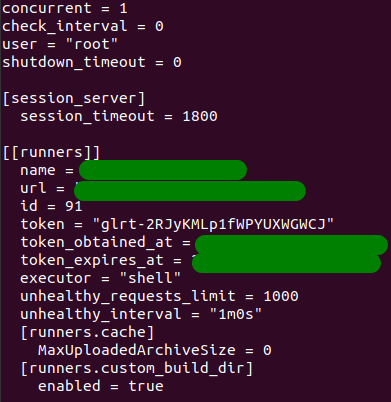

# How To Create, Register and Run Your Own Project Runner

## Tutorial: https://docs.gitlab.com/ee/tutorials/create_register_first_runner/

## Auto rotate gitlab-runner authentication token: https://gist.github.com/pa7i3nt/4a408efa2504bc08eb042a8abc6bd5fe

## Setup example

