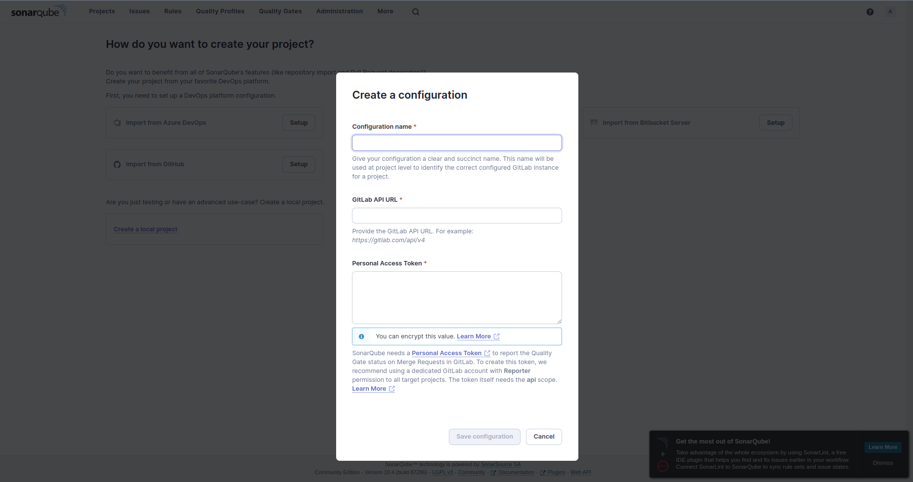
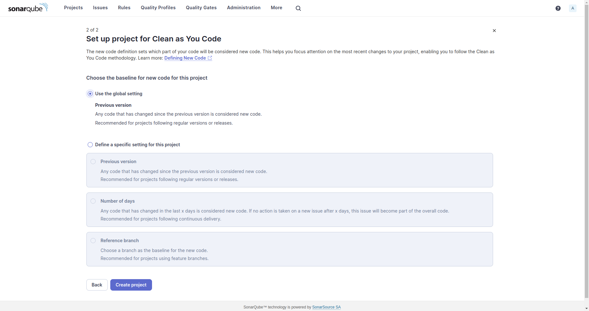

# How To Install SonarQube on Ubuntu 20.04LTS

## 1. Prepare your Ubuntu

```bash
sudo apt update

sudo apt upgrade -y

# Modify Kernel System Limits
sudo bash -c 'echo -e "vm.max_map_count=262144\nfs.file-max=65536\nulimit -n 65536\nulimit -u 4096" >> /etc/sysctl.conf'

# Reboot the system to apply new sysctl config
sudo reboot
```

## 2. Install OpenJDK 17

- Install OpenJDK 17.

```bash
sudo apt install -y openjdk-17-jdk
```

> **NOTE:** In the future, SonarQube will update to the newer version and require a newer Java version.

## 3. Install SonarQube and PostgreSQL via docker-compose

- Install Docker.

  - Linux post-installation steps for Docker Engine: https://docs.docker.com/engine/install/linux-postinstall/
  - Install Docker Engine on Ubuntu: https://docs.docker.com/engine/install/ubuntu/

- Install SonarQube and PostgreSQL via docker-compose.
  - docker-compose file: [docker-compose.yml](./docker-compose.yml)

```bash
docker compose up --build -d
```

## 4. Access SonarQube Web Interface

- Access SonarQube in a web browser at your server's IP address on port 9000. For example:
  http://localhost:9090 (According to SonarQube port config in [docker-compose.yml](./docker-compose.yml?plain=1#L20) file)

- Log in with username `admin` and password `admin`. SonarQube will prompt you to change your password.

> **WARNING!**
> SonarQube ships with a default administrator username and password of admin. This default password is not secure, so you’ll want to update it to something more secure as a good security practice.

## 5. Secure SonarQube

> **NOTE:**
> The following contents were quoted from [DigitalOcean site tutorial page](https://www.digitalocean.com/community/tutorials/how-to-ensure-code-quality-with-sonarqube-on-ubuntu-18-04),
> especially from **Step 5 - Securing SonarQube** to the end of that page.

Start by visiting the URL of your installation, and log in using the default credentials.
If prompted to start a tutorial, simply click Skip this tutorial to get to the dashboard.

Once logged in, click the `Administration` tab from the top menu, select `Security` from the drop-down list,
and then select `Users`:


From here, click on the small cog on the right of the `Administrator` account row, then click on `Change password`.
Be sure to change the password to something that’s easy to remember but hard to guess.

Now create a normal user that you can use to create projects and submit analysis results to your server
from the same page. Click on the `Create User` button on the top-right of the page:


Then create a token for a specific user by clicking on the button in the `Tokens` column
and giving this token a name. You’ll need this token later when you invoke the code scanner,
so be sure to write it down in a safe place.


Finally, you may notice that the SonarQube instance is wide-open to the world,
and anyone could view analysis results and your source code. This setting is highly insecure,
so we’ll configure SonarQube to only allow logged-in users access to the dashboard.
From the same `Administration` tab, click on `Configuration`, then `General` Settings,
and then `Security` on the left pane. Flip the switch that says `Force user authentication` to enable authentication,
then click on the `Save` button below the switch.


Now that you’re done setting up the server, let’s set up the SonarQube scanner.

## 6. Setting Up the Code Scanner

SonarQube’s code scanner is a separate package that you can install on a different machine than the one running
the SonarQube server, such as your local development workstation or a continuous delivery server. There are
packages available for Windows, MacOS, and Linux which you can find at [the SonarQube web site](https://docs.sonarqube.org/latest/analysis/scan/sonarscanner/).

In this tutorial, you’ll install the code scanner on the same server that hosts our SonarQube server.

- Start by creating a directory for the scanner:

```bash
sudo mkdir /opt/sonarscanner
```

- Change into that directory:

```bash
cd /opt/sonarscanner
```

- Download the SonarQube scanner for Linux using wget:

```bash
sudo wget https://binaries.sonarsource.com/Distribution/sonar-scanner-cli/sonar-scanner-cli-5.0.1.3006-linux.zip
```

- Extract the scanner:

```bash
sudo unzip sonar-scanner-cli-5.0.1.3006-linux.zip
```

- Delete the zip archive file:

```bash
sudo rm sonar-scanner-cli-5.0.1.3006-linux.zip
```

- After that, you’ll need to modify a few settings to get the scanner working with your server install. Open the configuration file for editing:

```bash
sudo nano sonar-scanner-cli-5.0.1.3006-linux/conf/sonar-scanner.properties
```

> **Step 1:** First, tell the scanner where it should submit the code analysis results. Un-comment the line starting with sonar.host.url and set it to the URL of your SonarQube server:
>
> ```
> sonar.host.url=http://127.0.0.1:9090
> ```
>
> **NOTE:** If you want to integrate with GitLab, you need to change the host url to your Ubuntu IP address.
>
> ```
> sonar.host.url=http://192.168.10.33:9090
> ```
>
> **Step 2:** Save and close the file.

- Make the scanner binary executable:

```bash
sudo chmod +x sonar-scanner-cli-5.0.1.3006-linux/bin/sonar-scanner
```

- Create a symbolic link so that you can call the scanner without specifying the path:

```bash
sudo ln -s /opt/sonarscanner/sonar-scanner-cli-5.0.1.3006-linux/bin/sonar-scanner /usr/local/bin/sonar-scanner

# If the above script is not working, run this script instead.
sudo ln -s /opt/sonarscanner/sonar-scanner-cli-5.0.1.3006-linux/bin/sonar-scanner /usr/bin/sonar-scanner
```

- Now that the scanner is set up, we’re ready to run our first code scan.

## 7. Run a Test Scan on SonarQube Example Projects

If you’d like to just poke around with SonarQube to see what it can do,
you might consider running a test scan on the SonarQube example projects.
These are [example projects](https://github.com/SonarSource/sonar-scanning-examples)
created by the SonarQube team that contains many issues
that SonarQube will then detect and report.

- Create a new working directory in your home directory, then change to the directory:

```bash
cd ~
mkdir sonar-test && cd sonar-test
```

- Clone the example project:

```bash
git clone https://github.com/SonarSource/sonar-scanning-examples.git example_project
```

- Switch to the example project directory:

```bash
cd example_project/sonarqube-scanner
```

- Run the scanner, passing it the token you created earlier in [Section 5](#5-secure-sonarqube):

```bash
sonar-scanner -D sonar.login=your_token_here
```

> This will take a while. Once the scan is complete, you’ll see something like this on the console:
>
> ```
> INFO: Analysis total time: 27.064 s
> INFO: ------------------------------------------------------------------------
> INFO: EXECUTION SUCCESS
> INFO: ------------------------------------------------------------------------
> INFO: Total time: 34.739s
> INFO: Final Memory: 37M/140M
> INFO: ------------------------------------------------------------------------
> ```
>
> The example project’s report will now be on the SonarQube dashboard like so:
> 
>
> Now that you’ve confirmed that the SonarQube server and scanner works with the test code, you can use SonarQube to analyze your own code.

## 8. Run a Scan on Your Own Code

To have SonarQube analyze your own code, start by transferring your project to the server, or follow Step 6
to install and configure the SonarQube scanner on your workstation and configure it to point to your
SonarQube server.

- Then, in your project’s root directory, create a SonarQube configuration file:

```bash
nano sonar-project.properties
```

> You’ll use this file to tell SonarQube a few things about your project.
>
> **Step 1:** First, define a project key, which is a unique ID for the project. You can use anything you’d like, but this ID must be unique for your SonarQube instance:
>
> ```
> # Unique ID for this project
> sonar.projectKey=foobar:hello-world
> ```
>
> **Step 2:** Then, specify the project name and version so that SonarQube will display this information in the dashboard:
>
> ```bash
> sonar.projectName=Hello World Project
> sonar.projectVersion=1.0
> ```
>
> **Step 3:** Finally, tell SonarQube where to look for the code files. Note that this is relative to the directory in which the configuration file resides. Set it to the current directory:
>
> ```bash
> # Path is relative to the sonar-project.properties file. Replace "\" by "/" on Windows.
> sonar.sources=.
> ```
>
> **Step 4:** Close and save the file.

- You’re ready to run a code quality analysis on your own code. Run sonar-scanner again, passing it your token:

```bash
sonar-scanner -D sonar.login=your_token_here
```

> Once the scan is complete, you’ll see a summary screen similar to this:
>
> ```bash
> INFO: Analysis total time: 1:22.100 s
> INFO: ------------------------------------------------------------------------
> INFO: EXECUTION SUCCESS
> INFO: ------------------------------------------------------------------------
> INFO: Total time: 1:24.856s
> INFO: Final Memory: 20M/74M
> INFO: ------------------------------------------------------------------------
> ```

- The project’s code quality report will now be on the SonarQube dashboard.

## 9. Custom Quality Gates

Check this [tutorial](https://youtu.be/x2CbwvXUTAs).

## 10. Custom Quality Profiles

Check this [tutorial](https://youtu.be/54YY2E41_Pg).

## 11. Intergrate SonarQube with GitLab

**Step 1:** Choose "Import from Gitlab".


**Step 2:** Fill all fields with your GitLab information.


**Step 3:** Fill the field with your GitLab Personal Access Token.


**Step 4:** Import the project you want integrate.


**Step 5:** Choose "Use the global setting".


**Step 6:** Choose "With GitLab CI".


**Step 7:** Add SONAR_TOKEN variable.


> **NOTE:** This value is the same as the token you created earlier in [Section 5](#5-secure-sonarqube) or you can create a new token.

**Step 8:** Add SONAR_HOST_URL variable.


> **NOTE:** This value is the same as the sonar.host.url value in [Section 6](#6-setting-up-the-code-scanner).

**Step 9:** Update project key to sonar-project.properties


> **NOTE:** Check this [file](./sonar-project.properties) for reference.

**Step 10:** Config gitlab-ci.yml file.


> **NOTE:** Check this [file](./.gitlab-ci.yml) for reference.
